# NEXTDOOR CHARITY

## A charity event organizer

[](https://pp4-nextdoor-charity.herokuapp.com/)

[Visit the live webpage](https://pp4-nextdoor-charity.herokuapp.com/)

## Table of Content

- [Project Overview](#project-overview)
    - [Project Goals](#project-goals)
    - [User Stories](#user-stories)
- [Design](#design)
    - [Wireframes](#wireframes)
    - [Data Model](#data-model)
    - [Agile Methodology](#agile-methodology)
- [Technologies](#technologies)
    - [Languages](#languages)
    - [Frameworks, Libraries, Softwares and Services](#frameworks-libraries-softwares-and-services)
- [Features](#features)
    - [Home Page and Navigation](#home-page-and-navigation)
    - [Create an Event](#create-an-event)
    - [My Events](#my-events)
    - [Login, Logout and Sign Up](#login-logout-and-sign-up)
    - [Event Details Page](#event-details-page)
    - [Editing and Deleting Events](#editing-and-deleting-events)
- [Future Features and Improvements](#future-features-and-improvements)
- [Validation](#validation)
    - [HTML Bealtify](#html-beautify)
    - [HTML Validation](#html-validation)
    - [CSS Validation](#css-validation)
    - [Lighthouse](#lighthouse)
    - [JavaScript validation](#javascript-validation)
    - [Python PEP8 Fomattinig](#python-pep8-fomattinig)
    - [Python PEP8 Validation](#python-pep8-validation)
- [Testing](#testing)
- [Deployment](#deployment)
    - [Heroku](#heroku)
    - [Forking, Creating a Local Clone and Setting Up Local Environment](#forking-creating-a-local-clone-and-setting-up-local-environment)
- [Bugs](#bugs)
- [Credits](#credits)

## Project Overview

### Project Goals

Nextdoor Charity is a charity event organizer, where users can register an account to create events for a charitable cause, or sign up to participate in one of the events advertised in the website.

The website is intuitive and easy to use, users can easily like or sign up to participate to an event, as well as unliking and caneling participation. New events submitted by users need approval from the website administrator. Once approved, the events can have their details updated by the event creator, in which case the event will need to be subject to reapproval. The event creator can also delete their events.

### Epics and User Stories

GitHub Issues was used to document the Epics and User stories used to develop the website.

- Epic: User Authentication
    - As a user I can sign in so that I can use all of the website features.
    - As a User I can Sign out so that I can safely leave the website.
    - As a user I can Sign Up so that I can log in to the website as a returning user.
- Epic: Event Organization
    - As a event organizer user I can create a new event so that I can display and promote my event for interested users.
    - As a event organizer user I can edit events I have created so that I can fix or amend information regarding my event.
    - As a event organizer I can delete an event I have previously created so that I inform a previously created event has been cancelled.
- Epic: Navigation
    - As a user I can access the home page so that I can find all the website information.
    - As a user I can View an event list so that I can see what events are happening in the future.
    - As a user I can view a list my events so that I can see in one place all events I am organizing or participating.
- Epic: Event Interaction
    - As a user I can register my interest in participating in an event so that I can save events I'm interested in going in my profile.
    - As a user I can cancel my participation in an event so that I can inform the event organizers that I am no longer attending and remove the event from my list.
    - As a user I can like events so that I can show I am interested in an event.


## Design

### Wireframes

The bellow wireframes were created for design the website main pages, which are the home page and the event detail page. The website is responsive and works well with most screens sizes, mobile and lapatops layout were prioritized.


### Data Model

The bellow diagram illustrates the initial event data model idealized for the project, this data model was modified in some ways during development. The comment model was not prioritized for this release and will be added as a future feature.

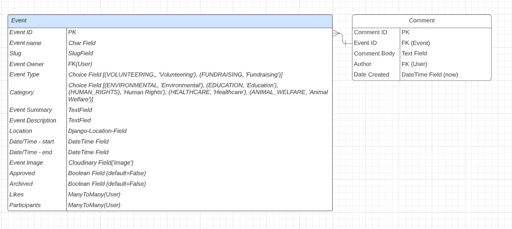

### Agile Methodology

GitHub Projects Kanban board was used to document project development. Issues containing user stories were placed in the columns To Do, In Progress, Testing and Done. Epics were left in their own column as these were used for project idealization, being broken down into user stories for project development.

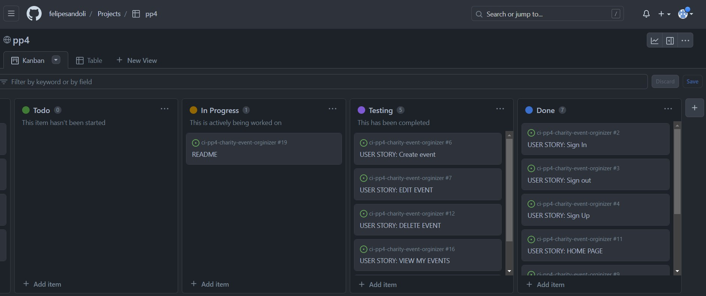

Some of the user stories were developed using Test Driven Development, going straight from In progress to Done skipping the Testing stage. Other user stories were tested after development.

## Technologis

### Languages

- HTML5
- CSS3
- JavaScript
- Python

### Frameworks, Libraries, Softwares and Services

- Django
- JQuery
- Cloudinary
- Django Crispy Forms
- Elephant SQL
- Bootstrap 5
- Lucid Charts
- PostgreSQL
- Psycopg2
- Gunicorn
- Heroku
- Git
- GitHub
- Font Awesome
- Google Fonts
- Gouger.io (favicon from Font Awesome icon)

## Features

### Home Page and Navigation

The home page consists of a navigation bar with a logo that acts as a link back to the homepage and a menu that collapses into a hamburger button on mobile phones, and a main section where events created and approved are displayed as cards with relevant information. All cards functions as a link to the event description page

The options in the navigation menu are for creating a new event, view the list of events owned or events the user is participating, and Login/Logout. If the user is not logged in, clicking on the Create Event or My Events options will redirect the user to the login page.

When authenticated, the user is presented a button for joining an event at the bottom of the card, it is also possible to like the event. The joining button is not displayed if the user is already in the list of participants for that event.

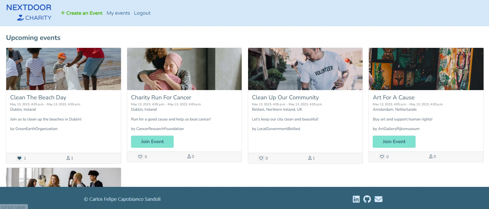

### Create an Event

The Create Event page is a form containing the following fields:

- Event Name
- Event Type
- Event Category
- Summary
- Description
- Location, containing address, city and contry
- Start and Ende Date and Time
- Option to submit a cover image for the event

Submitting the form successfuly will create an event in the database with some predefined attributes:

- Event owner will be set by the user that made the post request
- Approved will be set automatically to false. The site admin is responsible for reviewing and approving each event
- Archived will also be automatically set to false. There is still no functionality that allows the user to archive the event. This can only be done via the admin panel provided by Django.
- If no image is provided, the image will be set automatically to the text 'default_image'.

On successfull submission of the form, the user is redirected to the home page where a message is displayed to inform the user that the event has been created and is awaiting approval.

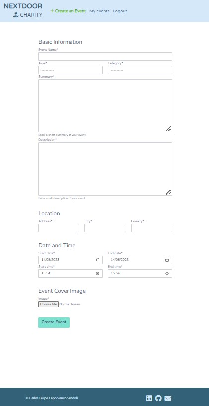
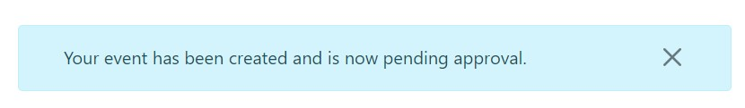

### My Events

In the my events page the user can see both the events they have created and events they have signed up to participate. All cards functions as a link to the event description page

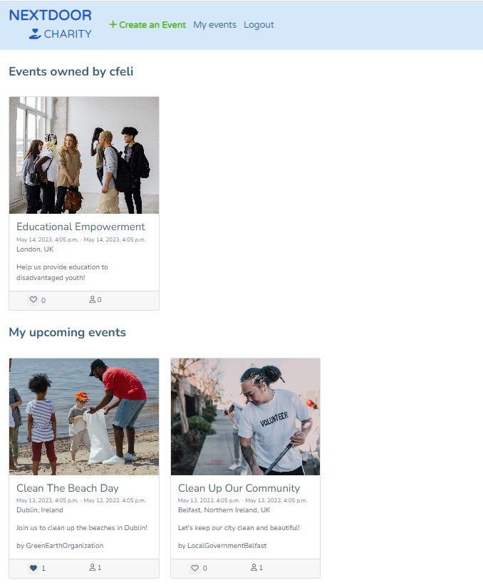

### Login, Logout and Sign Up

The website has basic authentication functionality, with a login page that contains a link to sign up page. Upun Loging in, out our signing up successfully, the user is always given a feedback through a message on the top of the page.

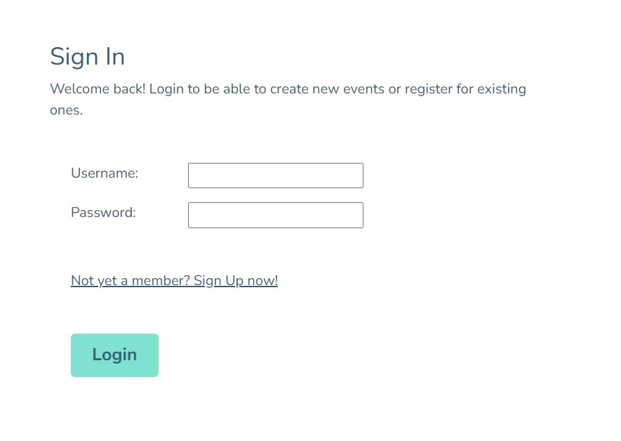
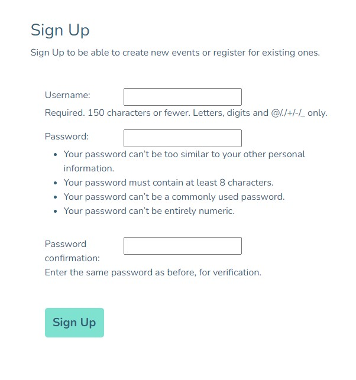
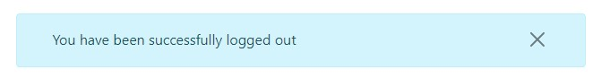

### Event Details Page

In the event details page, all the information about the particular event is displayed. This page is only accessible by authenticated users.

Here if the user is not the event owner, they have the option to like or sign up as a participant for that event. If already a participant they can cancel their participation.

Otherwise, if the user is the event owner, they have the option to Update or Delete the event.

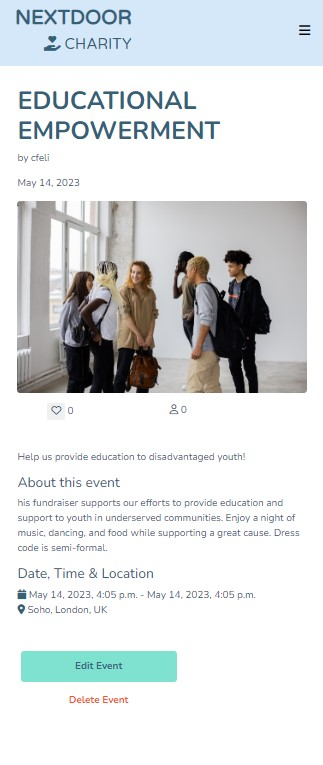

### Editing and Deleting Events

The event owner of an event has the ability of editing or deleting that event. By chosing to edit an event, the user is redirect to a form page similar to the event creation page, where all fields are prepopulated. Saving any alteration will make the event subject to admin review and approval again before being displayed in the website.

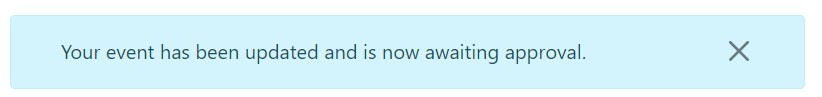

Before event deletion the user is redirected to a page where they are shown some information about the event and asked to confirm the event deletion. They can also cancel and return to the My events page.

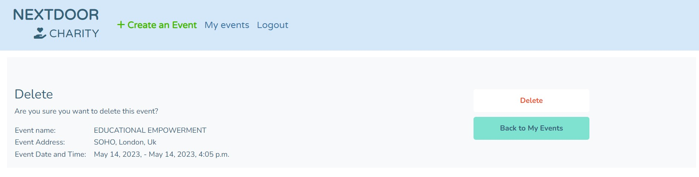

## Future Features and Improvements

Initially the project was idealized to include a map with the event location. A lot of effort was taken into implementing Django LocationField and Google Maps API and after a lot of problem solving and researching due to bugs, I came to the conclusion this would be a nice feature to have but not essential to the project primary functionalities.
Now with the project functioning as expected for a first realese it would be a good time to dive deep into utilizing these technologies to improve the User Experience of the website.

A comment section on the event details page was initially idealized but categorized as low priority from the start of the project, this could be impemented on a later release.

Another future improvement is allowing the event owners to easily archive their events and also auto archiving events that have already happened.

Adding more information about the organizations responsible for the events could also be implemented.

## Validation

### HTML Beautify

This online [HTML Beaultifier](https://htmlbeautify.com/) was used to improve the HTML code readability.

### HTML Validation

All pages passed W3C HTML validation:

- [Homepage](docs/README_docs/homepage-html-validation.jpg)
- [Create Event Page](docs/README_docs/create-form-html-validation.jpg)
- [My Event Page](docs/README_docs/my-events-html-validation.jpg)
- [Login Page](docs/README_docs/login-html-validation.jpg)
- [Sign Up Page](docs/README_docs/signup-html-validation.jpg)
- [Event Details Page](docs/README_docs/event-detail-html-validation.jpg)
- [Delete Event Page](docs/README_docs/delete-html-validation.jpg)
- [Edit Event Page](docs/README_docs/edit-event-html-validation.jpg)

### CSS Validation

Custom CSS was validated using W3C CSS Validator and passed with no issues. Report can be found [here](docs/README_docs/css-validation.jpg)

### Lighthouse

A good overall performance of Lighthouse validator can be observed [here](docs/README_docs/lighthouse.jpg)

### JavaScript validation

No error found using JSHint, one identified variable due to JQuery. See report [here](docs/README_docs/js-validation.jpg)

### Python PEP8 Fomattinig

[Black](https://github.com/psf/black) was used to format Python code for better readability. Unfortunatly this resulted in some PEP8 linter errors which were addressed manually.

### Python PEP8 Validation

PEPE8 was followed for writting python code. The [CI PEP8 linter](https://pep8ci.herokuapp.com/) was used on all python files in the prject and no errors were found with the exception of settings.py which contain autogenerated code from Django that was not modified to comply with PEP8.

## Testing

The following test were performed using the Django testing framework:

### View tests

The tests bellow were performed using Django's TestCase class and all passed.

- Tests the homepage loads with the correct template.
- Tests the user is taken to the correct page when logged in and trying to access an event detail page.
- Tests if the user is redirected to login page if attempting to access an event detail page via URL.
- Tests if the user is redirected to homepage if trying to access an event detail page that has not been approved.
- Tests if the user is redirected to the homepage when trying to access the detail page of an event that has already been archived.
- Tests if the user is redirected to the event detail page after signing up for that event.
- Tests if signing up for an event adds the user to that event's list of participants.
- Tests if signing up for an event adds that event to the user's list of events.
- Tests if the user is redirected to the event detail page after cancelling participation for that event.
- Tests if cancelling participation for an event removes the user from that event's list of participants.
- Tests if cancelling participation for an event removes that event from the user's list of events.

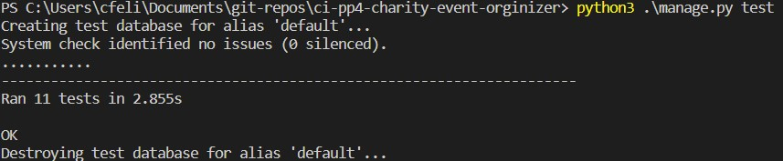

The bellow tests were performed manually and all behaved as expected.

- Submitting an event includes the event to the database but not displayed in the website.
- New event is added as not approved.
- User is informed with a message that the event has been created and is awaiting approval.
- User is redirected after successifully creating a new event.
- Editing and saving changes to an event changes it's status back to not approved.
- Database is updated with new information.
- Only the user that created a particular event is able to delete that event.
- User is asked to confirm if they wish to delete the event and are given an option to cancel.
- My Events page displays a list of events that user has created as well as a lit of events they have signed up to participate.
- Users that have not been authenticated are redirected to the login page when trying to access My Events page.
- User is able to see if they have already like an event.
- User can like and unlike events.

## Deployment

### Heroku

- On local environment, add list of dependencies by using the command:

```console
pip3 freeze --local > requirements.txt
```

- Create a Procfile on your project root directory with the following code, replacing 'project_name' according to your project name:

```
web: gunicorn project_name.wsgi
```

- Add HEROKU_APP to ALLOWED_HOSTS in settings.py.

- Push changes to github.

- On Heroku create a new app, chosing a name and selection your region.

- On the Settings tab, select "Reveal Config Vars" and add the following config vars:

    - CLOUDINARY_URL: Cloudinary database url. Documentation can be found [here](https://cloudinary.com/documentation)
    - DATABASE_URL: Elephant SQL database url. Documentation can be found [here](https://www.elephantsql.com/docs/)
    - HEROKU_APP: Your heroku app URL
    - PORT: 8000
    - SECRET_KEY : Django secret key which can be generated [here](https://miniwebtool.com/django-secret-key-generator/)

- On the Deploy tab select GitHub as the Deployment Method.

- Search for your repository and click connect

- Click Enable Automatic Deploys if you wish to allow a new deployment everytime code is pushed to your GitHub repository.

- Click on Deploy Branch.

- Once deployed click on View to open the deployed website.

### Forking, Creating a Local Clone and Setting Up Local Environment

- Login to GitHub and navigate to the project [repository](https://github.com/felipesandoli/ci-pp4-charity-event-orginizer)

- On the top of the page click on Fork and a copy of the repository will be made to your profile.

- On your forked repository click on the Code dropdown, select HTTPS and copy the repository url.

- On your chose command line interface navigate to your working directory and type `git clone` and pasting the copied repository url

- Create a virtual enviroment with:
 ```
 python3 -m venv env_name
 ```

 - Activate your local environment and install dependencies:

 ```
 pip3 install -r requirements.txt
 ```

 - Create a env.py file, adding it to .gitigonre and set the above mentioned config vars as environment variables, with the exception of HEROKU_APP.

## Bugs

- The images used for testing the website were compressed and optimized to improve performance. However if the user uploads an image of large file size when creating an event by submitting the event creation form, performance is reduced when displaying this image. A future fix could be using the Cloudinary API to properly size and process the image before uploading it to the storage.

- One bug found during development was related to using Django location field with the intent of displaying the event location on a map. The map displayed on the django admin page worked well when run locally, but did not load when deplyed to Heroku. As this feature was low priority, I decided to shift the focus to more important features. Now with the main functionality finished, I'm ready for diving into implementing this feature as it will be a great improvement to user experience.


## Credits

- CI Hello Django Walkthrough project: Using a development variable for configuring settings.py.
- CI I Think Therefore I Blog walkthrough project: Cloudinary setup and ListView implementation.
- [MDN](https://developer.mozilla.org/en-US/docs/Learn/Server-side/Django/Authentication#overview) tutorial: User Authentication.
- [LearnDjango](https://learndjango.com/tutorials/django-signup-tutorial) tutorial: User Sign up.
- [Eventbrite](https://www.eventbrite.com/)
: Inspiration for creating an event model, as well as the layout for displaying event information and form for event creation.
- [Devpress](https://devpress.csdn.net/python/6304b9ec7e6682346619c661.html) tutorial: for redirecting back to the previous page after form submission.
- ChaGPT was used to generate 5 event examples to test the functionality of the site with events that resemble real ones.

**NOTE:** Delete and Update functionality can only be performed on an approved event by the creator of that event. To test this functionality, please use the credentials 'test_user' and 'testpassword' for manipulating the Test Event.