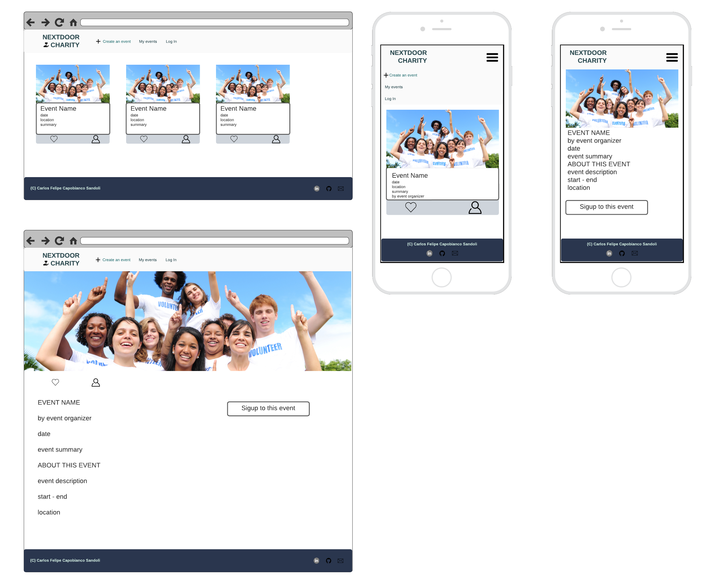

# NEXTDOOR CHARITY

## A charity event organizer

[Visit the live webpage](https://pp4-nextdoor-charity.herokuapp.com/)

## Table of Content

- [Project Overview](#project-overview)
    - [Project Goals](#project-goals)
    - [User Stories](#user-stories)
- [Design](#design)
    - [Wireframes](#wireframes)
    - [Agile Methodology](#agile-methodology)
- [Used Technologies](#used-technologis)
    - [Languages](#languages)
    - [Frameworks, Libraries, Softwares and Services](#frameworks-libraries-softwares-and-services)
- [Features](#features)
    - [Home Page and Navigation](#home-page-and-navigation)

## Project Overview

### Project Goals

Nextdoor Charity is a charity event organizer, where users can register an account to create events for a charitable cause, or sign up to participate in one of the events advertised in the website.

The website is intuitive and easy to use, users can easily like or sign up to participate to an event, as well as unliking and caneling participation. New events submitted by users need approval from the website administrator. Once approved, the events can have their details updated by the event creator, in which case the event will need to be subject to reapproval. The event creator can also delete their events.

### Epics and User Stories

GitHub Issues was used to document the Epics and User stories used to develop the website.

- Epic: User Authentication
    - As a user I can sign in so that I can use all of the website features.
    - As a User I can Sign out so that I can safely leave the website.
    - As a user I can Sign Up so that I can log in to the website as a returning user.
- Epic: Event Organization
    - As a event organizer user I can create a new event so that I can display and promote my event for interested users.
    - As a event organizer user I can edit events I have created so that I can fix or amend information regarding my event.
    - As a event organizer I can delete an event I have previously created so that I inform a previously created event has been cancelled.
- Epic: Navigation
    - As a user I can access the home page so that I can find all the website information.
    - As a user I can View an event list so that I can see what events are happening in the future.
    - As a user I can view a list my events so that I can see in one place all events I am organizing or participating.
- Epic: Event Interaction
    - As a user I can register my interest in participating in an event so that I can save events I'm interested in going in my profile.
    - As a user I can cancel my participation in an event so that I can inform the event organizers that I am no longer attending and remove the event from my list.
    - As a user I can like events so that I can show I am interested in an event.

## Design

### Wireframes

The bellow wireframes were created for design the website main pages, which are the home page and the event detail page. The website is responsive and works well with most screens sizes, mobile and lapatops layout were prioritized.

### Agile Methodology

GitHub Projects Kanban board was used to document project development. Issues containing user stories were placed in the columns To Do, In Progress, Testing and Done. Epics were left in their own column as these were used for project idealization, being broken down into user stories for project development.

Some of the user stories were developed using Test Driven Development, going straight from In progress to Done skipping the Testing stage. Other user stories were tested after development.

## Used Technologis

### Languages

- HTML5
- CSS3
- JavaScript
- Python

### Frameworks, Libraries, Softwares and Services

- Django
- JQuery
- Cloudinary
- Django Crispy Forms
- Elephant SQL
- Bootstrap 5
- Lucid Charts
- PostgreSQL
- Psycopg2
- Gunicorn
- Heroku
- Git
- GitHub
- Font Awesome
- Google Fonts
- Gouger.io (favicon from Font Awesome icon)

## Features

### Home Page and Navigation

The home page consists of a navigation bar with a logo that acts as a link back to the homepage and a menu that collapses into a hamburger button on mobile phones, and a main section where events created and approved are displayed as cards with relevant information. 

The options in the navigation menu are for creating a new event, view the list of events owned or events the user is participating, and Login/Logout. If the user is not logged in, clicking on the Create Event or My Events options will redirect the user to the login page.

When authenticated, the user is presented a button for joining an event at the bottom of the card, it is also possible to like the event. The joining button is not displayed if the user is already in the list of participants for that event.

